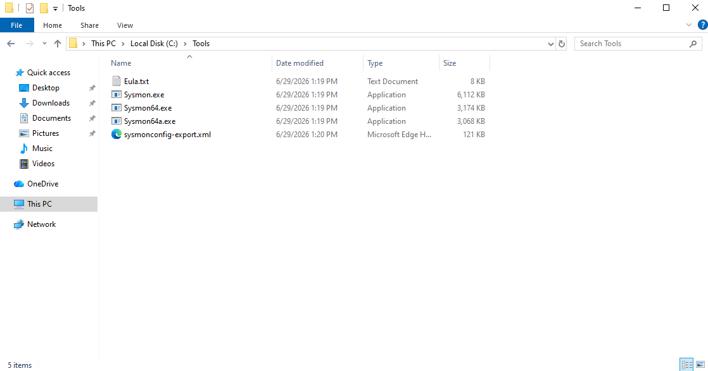
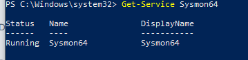

# Installing Sysmon

## Objective

The objective of this section is to install Sysmon on the Windows 10 virtual machine and configure it to collect detailed endpoint telemetry.

Sysmon provides visibility into activity such as process creation, network connections, file creation, and other events that are useful for security monitoring and SOC investigations.

---

## Prerequisites

Before starting, the following should already be completed:

- Windows 10 VM created in VirtualBox
- VM renamed to `WIN-SOC-01`
- Internet access confirmed inside the VM
- PowerShell available with Administrator privileges

---


---

---

## Step 1: Download Sysmon

Sysmon was downloaded from Microsoft Sysinternals.

Search for:

```text
Sysmon Microsoft Sysinternals
```

The correct download page is the Microsoft Learn Sysinternals page for Sysmon.

After downloading, the Sysmon ZIP file was extracted.

---

## Step 2: Create a Tools Folder

A tools directory was created on the Windows VM to store Sysmon and its configuration file.

I created the folder using PowerShell:

```powershell
mkdir C:\Tools
```

The extracted Sysmon files were placed in:

```text
C:\Tools
```

Important files in this folder included:

```text
Sysmon.exe
Sysmon64.exe
Sysmon64a.exe
Eula.txt
```

For this lab, the 64-bit executable was used:

```text
Sysmon64.exe
```

This folder was used to keep the Sysmon executable and configuration file in one organized location before installing Sysmon.

### Screenshot: Sysmon Files in Tools Folder



## Step 3: Download a Sysmon Configuration File

Sysmon can run with a default configuration, but using a configuration file improves the quality of the telemetry collected.

For this lab, I used a public Sysmon configuration file to help filter and organize the events generated by Sysmon.

The configuration file was saved as:

```text
sysmonconfig-export.xml
```

The configuration file was placed in the same folder as the Sysmon executable:

```text
C:\Tools
```

At this point, the `C:\Tools` folder contained both the Sysmon executable and the configuration file.

```text
C:\Tools
│
├── Sysmon.exe
├── Sysmon64.exe
├── Sysmon64a.exe
├── Eula.txt
└── sysmonconfig-export.xml
```

Using a configuration file helps make Sysmon more useful for security monitoring because it defines what types of endpoint activity should be logged.

For this lab, the configuration file was used during the Sysmon installation command:

```powershell
.\Sysmon64.exe -accepteula -i .\sysmonconfig-export.xml
```

This command installed Sysmon and applied the configuration file at the same time.

---

## Step 4: Open PowerShell as Administrator

PowerShell was opened with Administrator privileges so Sysmon could be installed as a Windows service and driver.

Administrator privileges are required because Sysmon needs permission to install and run in the background on the Windows endpoint.

To open PowerShell as Administrator:

1. Click the Windows Start menu.
2. Search for `PowerShell`.
3. Right-click **Windows PowerShell**.
4. Select **Run as administrator**.
5. Click **Yes** if prompted by User Account Control.

After opening PowerShell as Administrator, the window title showed:

```text
Administrator: Windows PowerShell
```

This confirmed that PowerShell was running with elevated privileges.

Running PowerShell as Administrator allowed the Sysmon installation command to be executed successfully in the next step.

---

## Step 5: Navigate to the Sysmon Folder

After opening PowerShell as Administrator, I navigated to the folder where the Sysmon files were stored.

The Sysmon files were located in:

```text
C:\Tools
```

I used the following command to change into the `C:\Tools` directory:

```powershell
cd C:\Tools
```

After changing directories, I confirmed that the Sysmon files were present by running:

```powershell
dir
```

The expected files included:

```text
Sysmon.exe
Sysmon64.exe
Sysmon64a.exe
Eula.txt
sysmonconfig-export.xml
```

The most important files for this installation were:

| File | Purpose |
|---|---|
| `Sysmon64.exe` | The 64-bit Sysmon executable used for installation |
| `sysmonconfig-export.xml` | The configuration file applied during installation |

Confirming the files were present helped ensure that the Sysmon installation command would run from the correct directory.

---

## Step 6: Install Sysmon

After confirming that the Sysmon files and configuration file were located in `C:\Tools`, I installed Sysmon using PowerShell as Administrator.

The installation command used was:

```powershell
.\Sysmon64.exe -accepteula -i .\sysmonconfig-export.xml
```

### Command Breakdown

| Command Part | Purpose |
|---|---|
| `.\Sysmon64.exe` | Runs the 64-bit Sysmon executable from the current folder |
| `-accepteula` | Accepts the Sysmon license agreement |
| `-i` | Installs Sysmon as a Windows service |
| `.\sysmonconfig-export.xml` | Applies the Sysmon configuration file during installation |

After running the command, Sysmon installed as a Windows service and started monitoring activity on the endpoint.

I then verified the installation by running the command Get-Service Sysmon64 

### Screenshot: Sysmon Service Running



PowerShell displayed installation output showing that Sysmon was installed, the Sysmon driver was installed, and the Sysmon service was started.

This step completed the actual Sysmon installation process and applied the configuration file so that Sysmon could begin generating endpoint telemetry.
