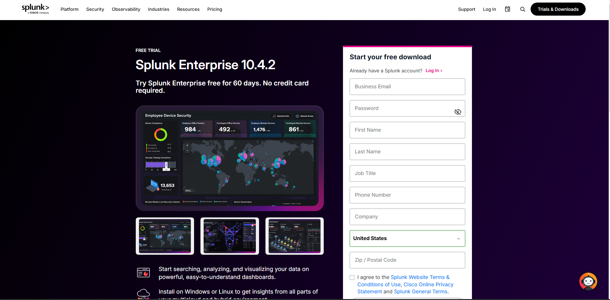
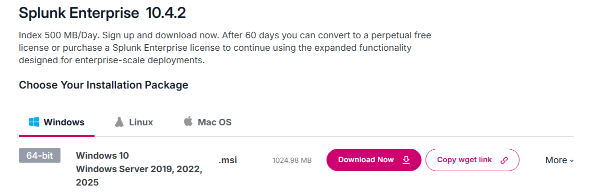

# Installing Splunk Enterprise

## Objective

The objective of this section is to install Splunk Enterprise on the Windows 10 virtual machine so it can be used as the SIEM/log analysis platform for the SOC home lab.

Splunk will be used to ingest, search, and analyze Windows and Sysmon event logs generated by the endpoint.

---

## Step 1: Download Splunk Enterprise

Splunk Enterprise was downloaded from the official Splunk website.

Search for:

```text
Splunk Enterprise download
```

The correct download page is the Splunk **Free Trials & Downloads** page.

On the download page, I selected:

```text
Splunk Enterprise
```

Then I selected the Windows installer:

```text
Windows 64-bit .msi
```

For this lab, I downloaded the Windows 64-bit MSI installer because Splunk was being installed directly on the Windows 10 virtual machine.

The installer file was saved locally before beginning installation.

### Why Splunk Enterprise?

Splunk Enterprise was used because it provides a web interface for searching and analyzing logs. In this lab, Splunk acts as the SIEM where Sysmon and Windows event logs can be searched using SPL queries.

### Screenshot: Splunk Enterprise Download Page



## Step 2: Run the Splunk Installer

After downloading the Windows 64-bit `.msi` installer, I opened the installer to begin the Splunk Enterprise installation process.

The installer was launched from the Downloads folder on the Windows 10 VM.

During the installation, I accepted the license agreement and continued with the default installation options.

### Installation Notes

For this lab, Splunk Enterprise was installed directly on the Windows VM. This made the setup easier because the Windows endpoint and Splunk instance were running on the same machine.

The default installation path was used:

```text
C:\Program Files\Splunk
```

Using the default path makes it easier to locate Splunk files, configuration folders, and command-line tools later in the lab.

### Why Default Options Were Used

The default installation options were selected because this was a beginner SOC home lab. The goal was to get Splunk running locally so Windows and Sysmon logs could be ingested and searched.

Default settings are acceptable for this lab because:

- The environment is local and isolated
- Only one Windows VM is being monitored
- The setup is for learning and testing
- Advanced deployment configuration is not required yet

### Screenshot: Splunk Installer



---

## Step 3: Configure Splunk Admin Account

During the Splunk Enterprise installation process, I was prompted to create an administrator account for the Splunk web interface.

This account is used to log in to Splunk and manage the local Splunk instance.

For this lab, I created a local Splunk administrator account during setup.

```text
Username: admin
Password: [password created during installation]
```

The password is not documented in this repository for security reasons.

### Why This Step Matters

The Splunk administrator account is needed to:

- Log in to the Splunk web interface
- Configure data inputs
- Manage indexes
- Search and analyze logs
- Restart or manage Splunk services if needed

After creating the admin account, the installer continued the setup process and prepared Splunk Enterprise to run locally on the Windows VM.
