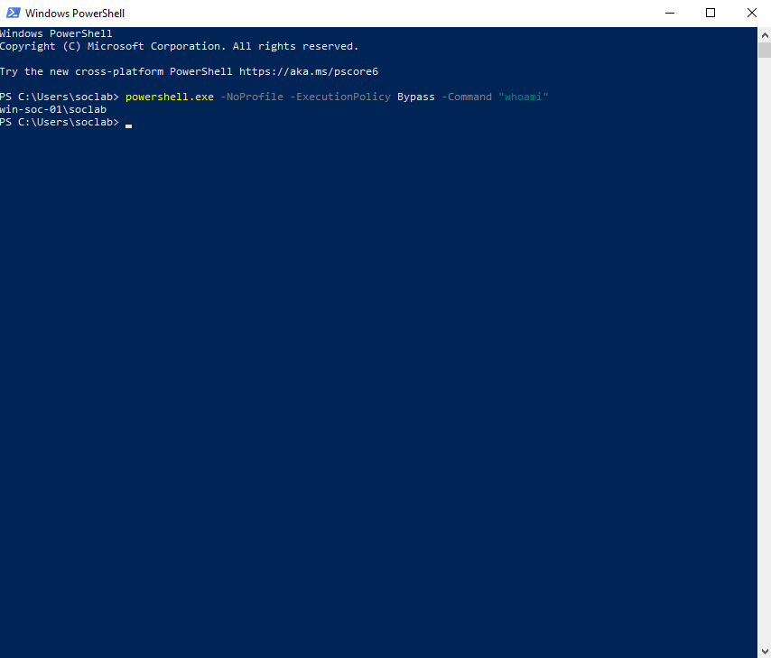
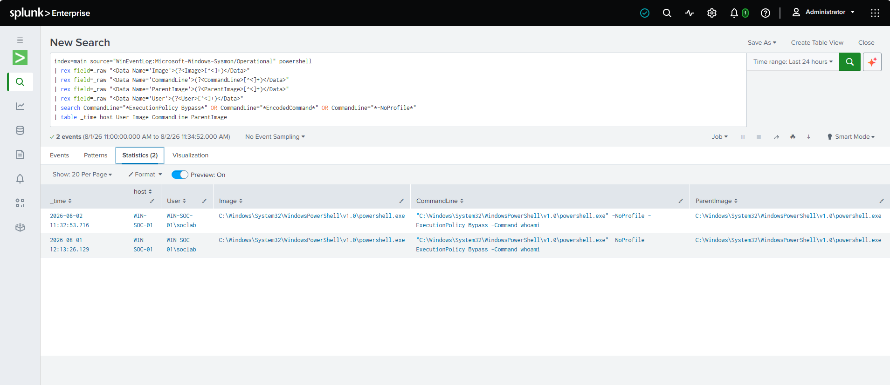

# Lab 02: Suspicious PowerShell Detection

## Objective

The objective of this lab was to detect suspicious PowerShell process execution using Sysmon Event ID 1 and Splunk.

This lab builds on the previous Sysmon and Splunk setup by generating a safe test event, searching for the activity in Splunk, extracting important fields, and creating a basic detection for suspicious PowerShell command-line arguments.

---

## Lab Environment

| Component | Details |
|---|---|
| Virtualization | VirtualBox |
| Endpoint VM | Windows 10 |
| Hostname | WIN-SOC-01 |
| Logging Tool | Sysmon |
| SIEM | Splunk Enterprise Free |
| Log Source | Microsoft-Windows-Sysmon/Operational |
| Splunk Index | main |
| Main Event ID | Sysmon Event ID 1 - Process Creation |
| Test User | soclab |

---

## Background

PowerShell is a legitimate Windows administration tool, but it is also commonly abused by attackers for execution, defense evasion, and post-exploitation activity.

This lab focuses on detecting suspicious PowerShell command-line flags such as:

```text
-NoProfile
-ExecutionPolicy Bypass
-EncodedCommand
```

These flags are not automatically malicious, but they are commonly reviewed by SOC analysts because they may indicate an attempt to bypass restrictions, hide activity, or execute commands in a less visible way.

---

## Step 1: Generate Suspicious PowerShell Activity

To generate a safe test event, I opened PowerShell on the Windows VM and ran the following command:

```powershell
powershell.exe -NoProfile -ExecutionPolicy Bypass -Command "whoami"
```

This command is safe because it only runs:

```powershell
whoami
```

However, it uses suspicious PowerShell flags that are useful for detection testing.

### Command Breakdown

| Command Part | Purpose |
|---|---|
| `powershell.exe` | Launches a new PowerShell process |
| `-NoProfile` | Starts PowerShell without loading the user profile |
| `-ExecutionPolicy Bypass` | Bypasses the local PowerShell execution policy for the session |
| `-Command "whoami"` | Runs the `whoami` command |

---

## Step 2: Search for PowerShell Events in Splunk

After running the test command, I searched the Sysmon Operational log in Splunk.

Initial search:

```spl
index=main source="WinEventLog:Microsoft-Windows-Sysmon/Operational" powershell
```

This search returned Sysmon events related to PowerShell activity.

---

## Step 3: Extract Useful Fields from Raw XML Logs

The Sysmon logs were ingested with the `XmlWinEventLog` sourcetype, so I used the `rex` command in Splunk to extract useful fields from the raw XML.

The extracted fields included:

| Field | Description |
|---|---|
| `Image` | The process that executed |
| `CommandLine` | The full command-line arguments |
| `ParentImage` | The process that launched PowerShell |
| `User` | The user account that executed the process |

Field extraction query:

```spl
index=main source="WinEventLog:Microsoft-Windows-Sysmon/Operational" powershell
| rex field=_raw "<Data Name='Image'>(?<Image>[^<]+)</Data>"
| rex field=_raw "<Data Name='CommandLine'>(?<CommandLine>[^<]+)</Data>"
| rex field=_raw "<Data Name='ParentImage'>(?<ParentImage>[^<]+)</Data>"
| rex field=_raw "<Data Name='User'>(?<User>[^<]+)</Data>"
| table _time host User Image CommandLine ParentImage
```

---

## Step 4: Create a Detection for ExecutionPolicy Bypass

Next, I filtered the PowerShell events for the suspicious command-line argument:

```text
ExecutionPolicy Bypass
```

Detection query:

```spl
index=main source="WinEventLog:Microsoft-Windows-Sysmon/Operational" powershell
| rex field=_raw "<Data Name='Image'>(?<Image>[^<]+)</Data>"
| rex field=_raw "<Data Name='CommandLine'>(?<CommandLine>[^<]+)</Data>"
| rex field=_raw "<Data Name='ParentImage'>(?<ParentImage>[^<]+)</Data>"
| rex field=_raw "<Data Name='User'>(?<User>[^<]+)</Data>"
| search CommandLine="*ExecutionPolicy Bypass*"
| table _time host User Image CommandLine ParentImage
```

This query detects PowerShell process creation events where the command line contains `ExecutionPolicy Bypass`.

---

## Step 5: Create a Combined Suspicious PowerShell Detection

After confirming that the detection worked, I created a broader detection query to look for multiple suspicious PowerShell indicators.

Final detection query:

```spl
index=main source="WinEventLog:Microsoft-Windows-Sysmon/Operational" powershell
| rex field=_raw "<Data Name='Image'>(?<Image>[^<]+)</Data>"
| rex field=_raw "<Data Name='CommandLine'>(?<CommandLine>[^<]+)</Data>"
| rex field=_raw "<Data Name='ParentImage'>(?<ParentImage>[^<]+)</Data>"
| rex field=_raw "<Data Name='User'>(?<User>[^<]+)</Data>"
| search CommandLine="*ExecutionPolicy Bypass*" OR CommandLine="*EncodedCommand*" OR CommandLine="*-NoProfile*"
| table _time host User Image CommandLine ParentImage
```

This detection searches for PowerShell process creation events containing:

```text
ExecutionPolicy Bypass
EncodedCommand
-NoProfile
```

---

## Step 6: Analyze the Detection Result

The detection returned a PowerShell process creation event from the Windows VM.

Observed activity:

```text
Host: WIN-SOC-01
User: WIN-SOC-01\soclab
Image: C:\Windows\System32\WindowsPowerShell\v1.0\powershell.exe
CommandLine: powershell.exe -NoProfile -ExecutionPolicy Bypass -Command whoami
ParentImage: C:\Windows\System32\WindowsPowerShell\v1.0\powershell.exe
```

This confirmed that Sysmon recorded the PowerShell process creation event and Splunk successfully detected the suspicious command-line arguments.

---

## Why This Activity Is Suspicious

PowerShell is commonly used for legitimate administration, but attackers may abuse it to execute commands, download payloads, or bypass security restrictions.

The following indicators are worth reviewing:

| Indicator | Why It Matters |
|---|---|
| `ExecutionPolicy Bypass` | May be used to bypass PowerShell script execution restrictions |
| `NoProfile` | Runs PowerShell without loading the user profile, which can reduce visibility or avoid user-specific controls |
| `EncodedCommand` | May be used to hide or obfuscate the command being executed |
| Parent process | Helps determine how PowerShell was launched |
| Command line | Shows the exact command that was executed |

This activity is not automatically malicious, but in a real environment it should be investigated in context.

---

## Recommended Analyst Response

If this detection triggered in a real SOC environment, the analyst should:

1. Review the full PowerShell command line.
2. Identify the user account that executed the command.
3. Check the parent process to understand how PowerShell was launched.
4. Search for additional PowerShell activity from the same host and user.
5. Review related Sysmon events, such as file creation, network connections, and DNS queries.
6. Determine whether the activity was expected administrative behavior or potentially unauthorized.
7. Escalate or isolate the host if the activity appears malicious.

---
## Screenshots

Add screenshots below after saving them in the `screenshots` folder.

### Screenshot: PowerShell Test Command



### Screenshot: Suspicious PowerShell Detection Result



---

## Result

A Splunk detection was created to identify suspicious PowerShell execution using Sysmon Event ID 1 process creation logs.

The detection successfully identified PowerShell activity containing suspicious command-line flags such as `ExecutionPolicy Bypass` and `NoProfile`.

This lab demonstrated how Sysmon and Splunk can be used together to detect and investigate suspicious endpoint activity.

---

## Lessons Learned

- Sysmon Event ID 1 provides valuable process creation telemetry.
- PowerShell command-line arguments are important for identifying suspicious activity.
- Splunk can extract useful fields from raw XML logs using `rex`.
- Parent-child process relationships help analysts understand how a process was launched.
- Suspicious PowerShell flags are not automatically malicious, but they should be investigated in context.

---

## Detection Query File

The final detection query is also saved separately in:

```text
detection-query.spl
```
