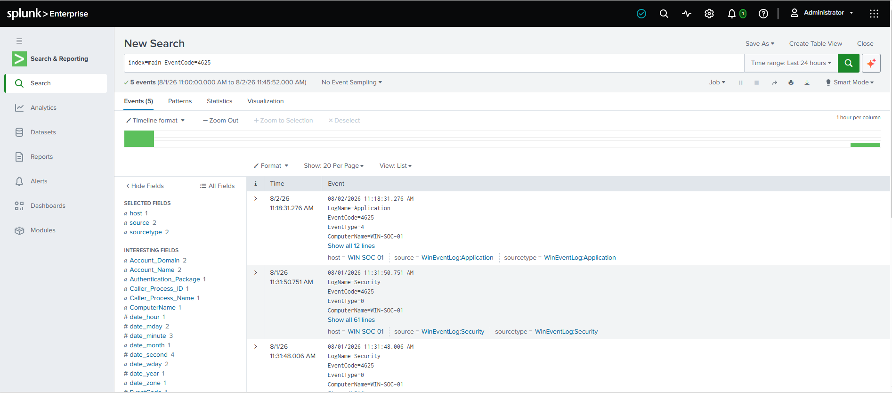
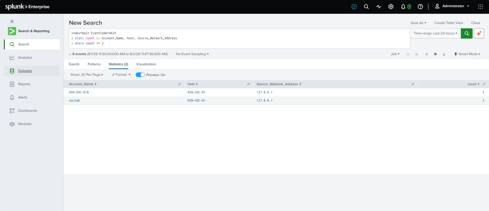
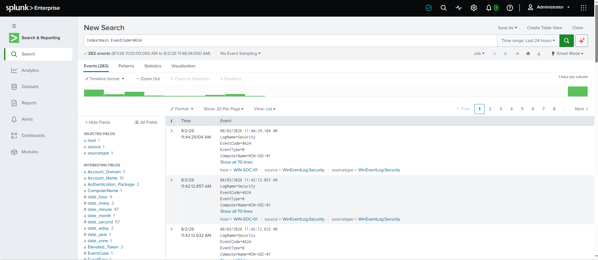

# Lab 03: Failed Windows Login Detection

## Objective

The objective of this lab was to detect failed Windows login attempts using Windows Security Event Logs and Splunk.

This lab focuses on identifying Windows Event ID `4625`, which represents a failed logon attempt. Detecting repeated failed logins is a common SOC analyst task because it may indicate password guessing, brute-force activity, unauthorized access attempts, or misconfigured services.

---

## Lab Environment

| Component | Details |
|---|---|
| Virtualization | VirtualBox |
| Endpoint VM | Windows 10 |
| Hostname | WIN-SOC-01 |
| SIEM | Splunk Enterprise Free |
| Log Source | Windows Security Logs |
| Splunk Index | main |
| Main Event ID | 4625 - Failed Logon |
| Related Event ID | 4624 - Successful Logon |
| Test User | soclab |

---

## Background

Windows Security Event Logs record authentication activity on the endpoint.

For this lab, the main event analyzed was:

```text
Event ID 4625 - An account failed to log on
```

This event is useful for detecting failed login attempts and can help analysts investigate possible unauthorized access activity.

A related event is:

```text
Event ID 4624 - An account was successfully logged on
```

Correlating failed login events with successful login events can help identify suspicious patterns, such as multiple failed attempts followed by a successful login.

---

## Step 1: Generate Failed Login Activity

To generate test data, I locked the Windows VM and attempted to log in with an incorrect password multiple times.

This created failed logon events in the Windows Security log.

Example test activity:

```text
1. Lock the Windows VM.
2. Attempt to log in with the wrong password several times.
3. Log in successfully after generating failed attempts.
```

This simulated repeated failed authentication activity in a controlled lab environment.

---

## Step 2: Search for Failed Login Events in Splunk

After generating failed login activity, I searched for Windows Event ID `4625` in Splunk.

Initial search:

```spl
index=main EventCode=4625
```

This search returns failed Windows logon events.

If no results appear, the time range should be changed to:

```text
All time
```

or:

```text
Last 24 hours
```

depending on when the test activity was generated.

---

## Step 3: Create a Readable Failed Login Table

To make the failed login events easier to review, I created a table showing important fields.

```spl
index=main EventCode=4625
| table _time host Account_Name Logon_Type Failure_Reason Source_Network_Address
```

If some fields do not appear, a broader version can be used:

```spl
index=main EventCode=4625
| table _time host EventCode Message
```

This helps confirm that Splunk is receiving failed login events even if field extraction is limited.

---

## Step 4: Search for Successful Login Events

After reviewing failed logins, I searched for successful Windows logon events using Event ID `4624`.

```spl
index=main EventCode=4624
```

Event ID `4624` represents a successful logon.

This is useful because analysts may need to determine whether repeated failed logins were followed by a successful login.

A readable table can be created with:

```spl
index=main EventCode=4624
| table _time host Account_Name Logon_Type Source_Network_Address
```

---

## Step 5: Create a Failed Login Detection

Next, I created a basic detection that counts failed login attempts by account, host, and source address.

```spl
index=main EventCode=4625
| stats count by Account_Name, host, Source_Network_Address
| where count >= 3
```

This query looks for accounts or source addresses with three or more failed login attempts.

The threshold of `3` was used for lab testing. In a real environment, the threshold may need to be adjusted based on normal user behavior and organizational policy.

---

## Step 6: Analyze the Detection Result

The detection identified repeated failed login attempts on the Windows VM.

Key details to review include:

| Field | Description |
|---|---|
| `_time` | Time the failed login occurred |
| `host` | Endpoint where the failed login was recorded |
| `Account_Name` | Account involved in the failed logon |
| `Logon_Type` | Type of logon attempt |
| `Failure_Reason` | Reason the logon failed |
| `Source_Network_Address` | Source address of the logon attempt, if available |

Repeated failed login attempts may indicate:

- Password guessing
- Brute-force activity
- Mistyped user credentials
- A misconfigured service or scheduled task
- Unauthorized access attempts

---

## Step 7: Recommended Analyst Response

If this detection triggered in a real SOC environment, the analyst should:

1. Review the account involved in the failed login attempts.
2. Confirm whether the activity was expected or user-generated.
3. Check if the failed attempts were followed by a successful login.
4. Review the source IP address or host if available.
5. Look for similar failed login activity across other systems.
6. Determine whether account lockout or password reset actions are needed.
7. Escalate if the activity appears unauthorized or malicious.

---

## Screenshots

Add screenshots below after saving them in the `screenshots` folder.

### Screenshot: Failed Login Search



### Screenshot: Failed Login Detection Result



### Screenshot: Successful Login Search



---

## Result

A Splunk detection was created to identify repeated failed Windows login attempts using Windows Security Event ID `4625`.

This lab demonstrated how Windows authentication logs can be used to identify suspicious login behavior and support basic SOC investigations.

---

## Lessons Learned

- Windows Event ID `4625` is used to identify failed logon attempts.
- Windows Event ID `4624` is used to identify successful logons.
- Repeated failed logins can indicate possible brute-force activity or unauthorized access attempts.
- Splunk can be used to count and group authentication events by account, host, and source address.
- Failed login detections should be reviewed in context before determining whether activity is malicious.

---

## Detection Query File

The final detection query is also saved separately in:

```text
detection-query.spl
```
