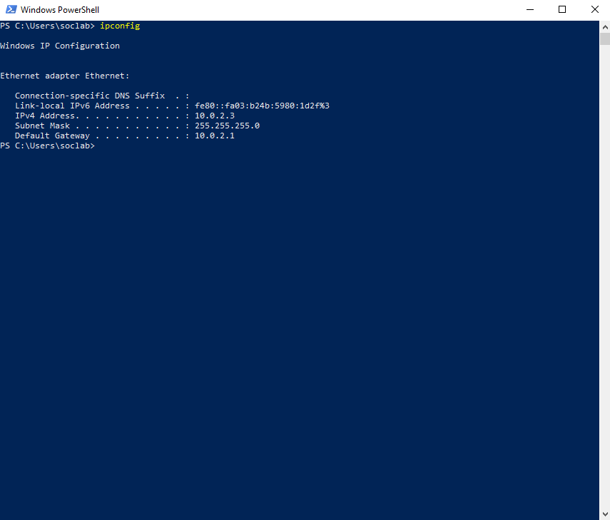
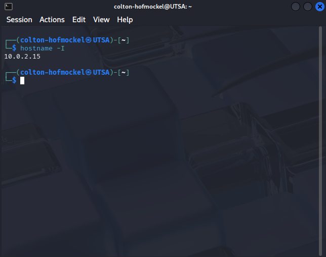
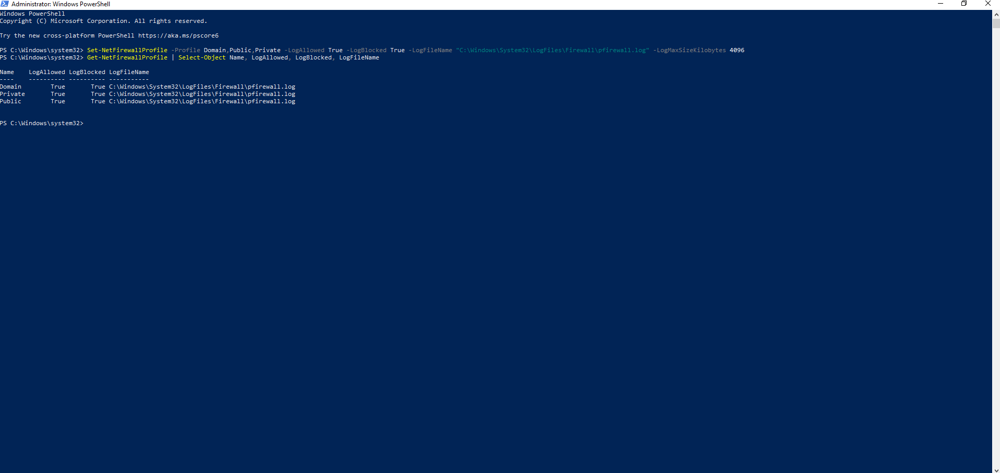
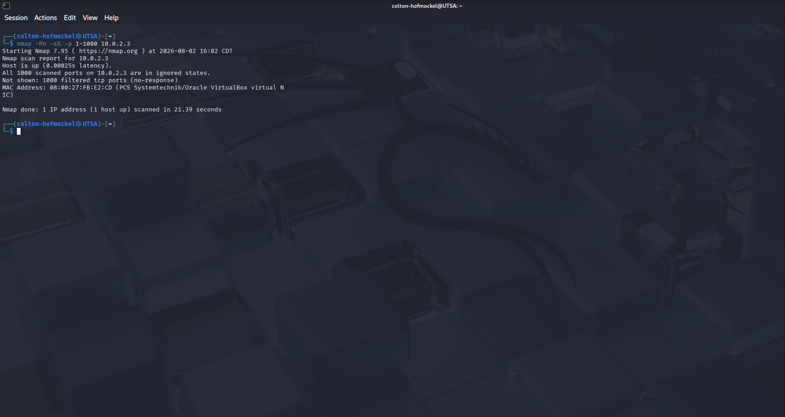
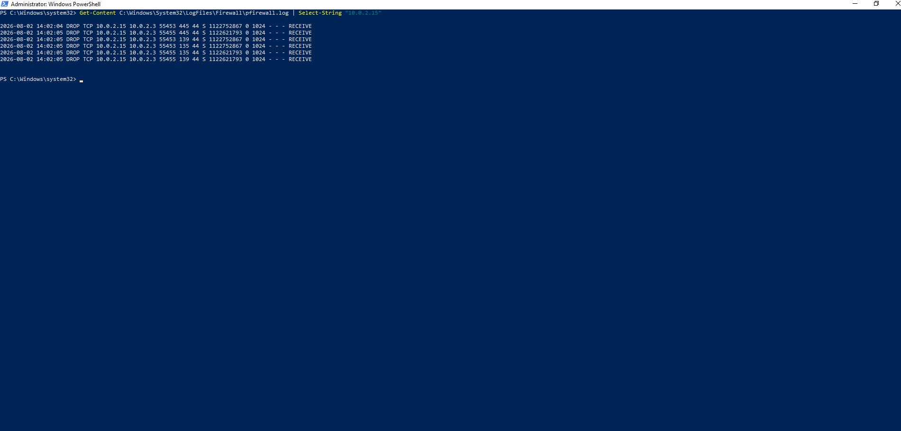
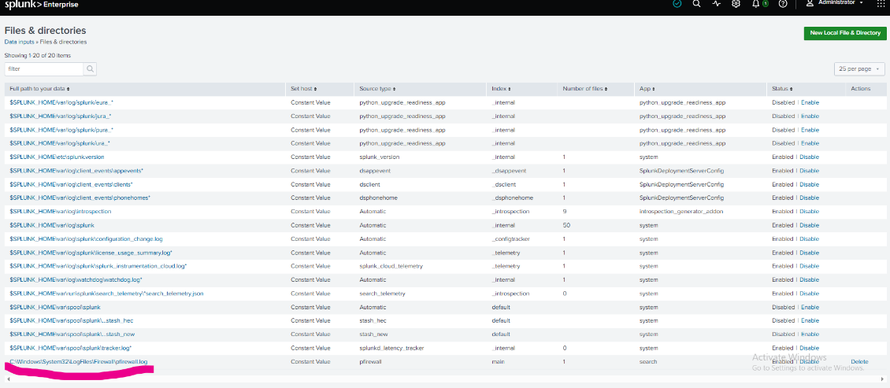
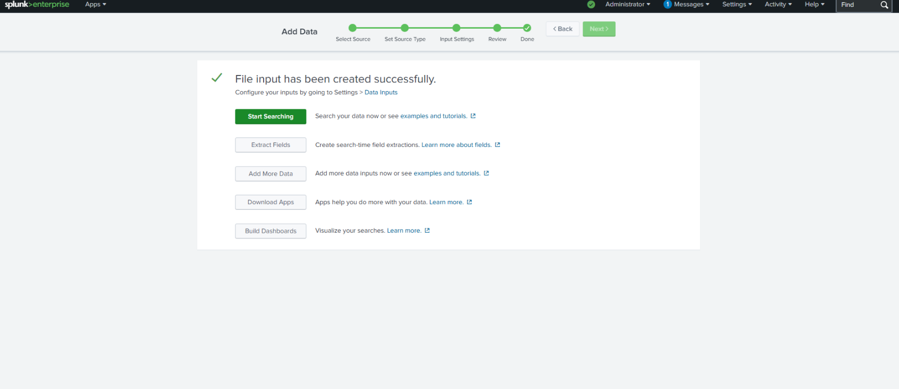
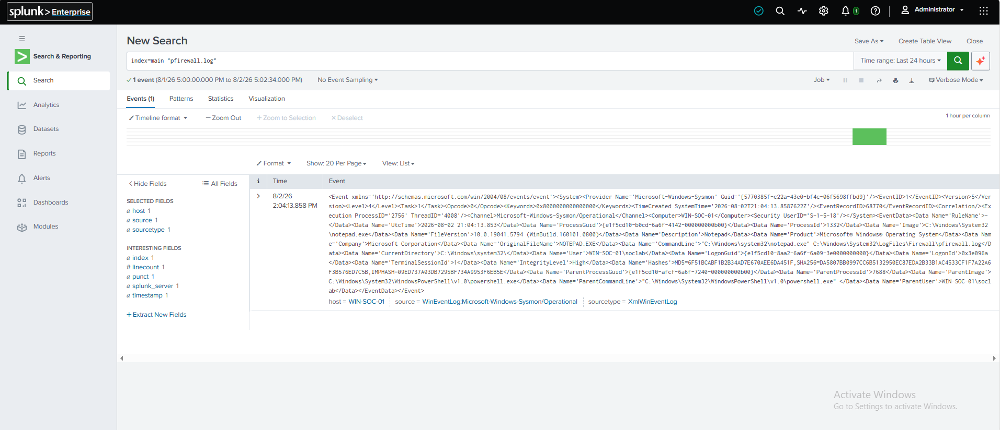
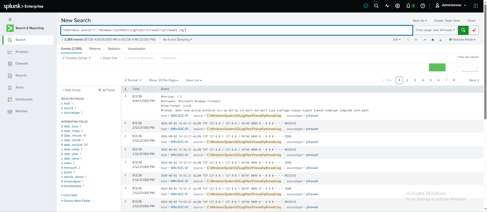

# Lab 04: Windows Firewall Nmap Scan Detection with Splunk

## Objective

The objective of this lab was to detect network reconnaissance activity using Windows Firewall logs and Splunk.

This lab used Kali Linux to run an Nmap scan against a Windows 10 VM. Windows Firewall logging captured the scan traffic, and Splunk was used to ingest, search, parse, and detect the activity.

---

## Lab Environment

| Component | Details |
|---|---|
| Virtualization | VirtualBox |
| Attacker/Test VM | Kali Linux |
| Monitored Endpoint | Windows 10 |
| Windows Hostname | WIN-SOC-01 |
| Windows IP Address | 10.0.2.3 |
| Kali IP Address | 10.0.2.15 |
| Log Source | Windows Firewall Log |
| Firewall Log Path | C:\Windows\System32\LogFiles\Firewall\pfirewall.log |
| SIEM | Splunk Enterprise Free |
| Detection Focus | Nmap scan / network reconnaissance |

---

## Background

Nmap is a network scanning tool used to discover hosts, open ports, and running services. It is commonly used by system administrators and security professionals, but similar scanning behavior can also be used by attackers during reconnaissance.

In this lab, Nmap was used in a controlled local environment against a Windows VM that I own and manage.

The goal was to generate scan traffic from Kali, capture that traffic with Windows Firewall logging, and search the logs in Splunk.

---

## Problem Encountered: Sysmon Did Not Show the Nmap Scan

The original plan for this lab was to detect the Nmap scan using Sysmon Event ID `3`, which records network connection events.

Initial Sysmon search:

```spl
index=main source="WinEventLog:Microsoft-Windows-Sysmon/Operational" "<EventID>3</EventID>"
```

However, the Nmap scan from Kali did not appear clearly in the Sysmon network connection logs.

This happened because Sysmon Event ID `3` primarily records network connections associated with Windows processes. Many inbound Nmap scan attempts were blocked by Windows Firewall or did not create full connections that Sysmon logged clearly.

Instead of stopping the lab, I changed the approach and used Windows Firewall logs, which are better suited for recording allowed and blocked inbound network traffic.

This troubleshooting step improved the lab because it showed how to choose the correct log source for the type of activity being investigated.

---

## Updated Detection Approach

The updated logging pipeline for this lab was:

```text
Kali Nmap Scan → Windows Firewall Log → Splunk → Detection Query
```

Windows Firewall logs were used because they can record dropped and allowed network traffic, including inbound scan attempts from Kali.

---

## Step 1: Confirm Lab Network Connectivity

Both the Kali Linux VM and Windows VM were started in VirtualBox and placed on the same NAT Network.

On the Windows VM, I used:

```cmd
ipconfig
```

The Windows VM IPv4 address was:

```text
10.0.2.3
```

On the Kali VM, I used:

```bash
hostname -I
```

The Kali VM IP address was:

```text
10.0.2.15
```

This confirmed that both virtual machines were on the same lab network.

### Screenshot: VM IP Addresses





---

## Step 2: Enable Windows Firewall Logging

On the Windows VM, I opened PowerShell as Administrator and enabled firewall logging for allowed and blocked traffic.

```powershell
Set-NetFirewallProfile -Profile Domain,Public,Private -LogAllowed True -LogBlocked True -LogFileName "C:\Windows\System32\LogFiles\Firewall\pfirewall.log" -LogMaxSizeKilobytes 4096
```

I then verified the firewall logging settings:

```powershell
Get-NetFirewallProfile | Select-Object Name, LogAllowed, LogBlocked, LogFileName
```

The output confirmed that firewall logging was enabled for the Domain, Private, and Public profiles.

### Screenshot: Firewall Logging Enabled



---

## Step 3: Run Nmap Scan from Kali

From the Kali VM, I ran an Nmap scan against the Windows VM.

```bash
nmap -Pn -sS -p 1-1000 10.0.2.3
```

If SYN scan permissions are required, the command can be run with `sudo`:

```bash
sudo nmap -Pn -sS -p 1-1000 10.0.2.3
```

The `-Pn` option tells Nmap to treat the host as online and skip host discovery. This is useful when ping is blocked by a firewall.

### Screenshot: Nmap Scan from Kali



---

## Step 4: Confirm Firewall Log Was Created

After running the scan, I checked the Windows Firewall log.

Firewall log path:

```text
C:\Windows\System32\LogFiles\Firewall\pfirewall.log
```

I opened the log with Notepad:

```powershell
notepad C:\Windows\System32\LogFiles\Firewall\pfirewall.log
```

I also filtered the log from PowerShell to show traffic from Kali:

```powershell
Get-Content C:\Windows\System32\LogFiles\Firewall\pfirewall.log | Select-String "10.0.2.15"
```

The firewall log showed dropped TCP traffic from the Kali VM IP address `10.0.2.15` to the Windows VM IP address `10.0.2.3`.

Example firewall log activity:

```text
DROP TCP 10.0.2.15 10.0.2.3
```

This confirmed that the Nmap scan generated firewall log entries.

### Screenshot: Windows Firewall Log Showing Kali Traffic



---

## Step 5: Add Firewall Log to Splunk

Next, I added the Windows Firewall log file as a Splunk data input.

In Splunk, I navigated to:

```text
Settings → Add Data → Monitor → Files & Directories
```

The file path added was:

```text
C:\Windows\System32\LogFiles\Firewall\pfirewall.log
```

Splunk was configured to continuously monitor the firewall log so new entries would be indexed as they were written.

### Screenshot: Splunk Firewall Log Input



### Screenshot: Splunk Firewall Log Input Created



---

## Step 6: Search Firewall Logs in Splunk

After adding the firewall log as a data input, I searched for the log events in Splunk.

Initial search:

```spl
index=main "pfirewall.log"
```

I also searched directly for the Kali IP address:

```spl
index=main "10.0.2.15"
```

This confirmed that Splunk was ingesting Windows Firewall log data and that traffic from Kali was searchable.

### Screenshot: Firewall Logs in Splunk



---

## Step 7: Create Nmap Scan Detection Query

The firewall logs were stored as raw text, so I used the `rex` command in Splunk to extract useful fields.

Detection query:

```spl
index=main "10.0.2.15"
| rex field=_raw "^(?<date>\d{4}-\d{2}-\d{2}) (?<time>\d{2}:\d{2}:\d{2}) (?<action>\w+) (?<protocol>\w+) (?<src_ip>\S+) (?<dst_ip>\S+) (?<src_port>\S+) (?<dst_port>\S+)"
| stats count dc(dst_port) as unique_ports values(dst_port) as scanned_ports by src_ip, dst_ip, action, protocol
| where unique_ports >= 10
```

This query identifies a source IP connecting to multiple destination ports.

In this lab, that behavior was generated by the Nmap scan from Kali.

### Detection Logic

| Field | Purpose |
|---|---|
| `src_ip` | Identifies the system initiating the traffic |
| `dst_ip` | Identifies the target system |
| `dst_port` | Shows the ports contacted during the scan |
| `unique_ports` | Counts how many different destination ports were contacted |
| `action` | Shows whether the firewall allowed or dropped the traffic |
| `protocol` | Shows the network protocol used |

A high number of unique destination ports from one source IP may indicate scanning or reconnaissance activity.

### Screenshot: Nmap Firewall Detection Result



---

## Step 8: Analyze the Detection Result

The detection result showed traffic from the Kali VM to the Windows VM across multiple destination ports.

Observed activity:

```text
Source IP: 10.0.2.15
Destination IP: 10.0.2.3
Action: DROP
Protocol: TCP
Activity: Multiple destination ports contacted
```

This behavior is consistent with network scanning.

In a real environment, this would be worth investigating because unauthorized port scanning can indicate internal reconnaissance before exploitation or lateral movement.

---

## Recommended Analyst Response

If this detection triggered in a real SOC environment, an analyst should:

1. Identify the source IP address.
2. Confirm whether the source system is authorized to scan the network.
3. Review the destination host and ports contacted.
4. Determine whether the traffic was allowed or blocked.
5. Search for additional activity from the same source IP.
6. Review related authentication, process creation, and firewall events.
7. Escalate if the scanning activity is unauthorized.

---

## Result

The original Sysmon-based approach did not clearly detect the Nmap scan, so the lab was adjusted to use Windows Firewall logs.

Windows Firewall logging successfully captured dropped TCP traffic from Kali, and Splunk was used to ingest and analyze the firewall log data.

A Splunk detection was created to identify scan-like behavior by counting unique destination ports contacted by a source IP.

This lab demonstrated how choosing the correct log source is an important part of detection engineering and SOC investigation.

---

## Lessons Learned

- Sysmon Event ID 3 does not always clearly capture blocked inbound scan traffic.
- Windows Firewall logs are more appropriate for detecting dropped inbound connection attempts.
- Nmap scan activity can be detected by looking for one source IP contacting many destination ports.
- Splunk can ingest flat log files such as `pfirewall.log`.
- The `rex` command can extract useful fields from raw firewall log data.
- Troubleshooting and changing the detection approach is part of real-world SOC work.
- The right log source depends on the behavior being investigated.

---

## Detection Query File

The final detection query is also saved separately in:

```text
detection-query.spl
```
